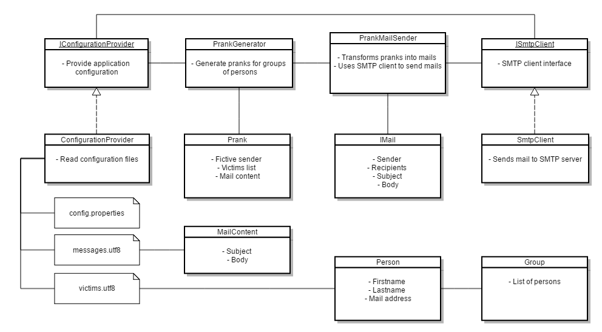
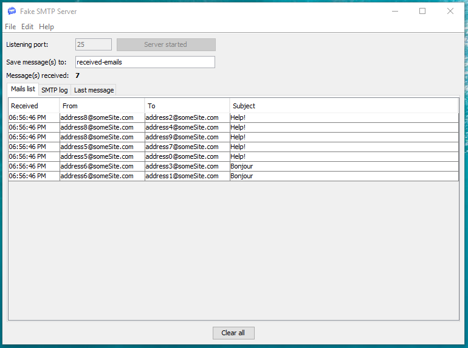

# Teaching-HEIGVD-RES-2016-Labo-SMTP

## Description du projet

Ce laboratoire est une introduction au protocole SMTP. Il a été réalisé dans le cadre du cours de Réseau à l'HEIG-VD (Haute école d'ingénierie et de gestion du canton de Vaud, Suisse).

Les objectifs du laboratoire sont :

* comprendre le fonctionnement du protocole SMTP entre le client et le serveur

* implémenter une version basique de ce protocole en Java, afin d'envoyer des mails directement depuis un socket

* comprendre qu'il est facile de spécifier une fausse adresse mail pour l'expéditeur

* réaliser une petite application paramétrable qui envoie des "prank mails" à un groupe d'adresses mail, en définissant un faux expéditeur

## Installation et configuration

### Installation de l'application

1. récupérer le contenu de ce repository

2. modifier les fichiers de configuration selon vos besoins

3. compiler et exécuter le projet Java

4. perdre vos amis :)

### Fichiers de configuration

* **config/config.properties** (paramètres SMTP et configuration des groupes) 

  * _smtpServerAddress_ : adresse du serveur SMTP
  
  * _smtpServerPort_ : port sur le serveur SMTP
  
  * _numberOfGroups_ : nombre de groupes à créer
  
  * _minimumGroupMembers_ : nombre minimum de personnes par groupe (un expéditeur fictif, le reste seront des destinataires)

  
* **config/victims.utf8** (liste des adresses mail cibles)

  * chaque ligne a la syntaxe suivante : prénom;nom;adresse_mail
  
  * les noms et prénoms ne sont pas encore utilisés pour personnaliser les mails, mais peut-être dans une prochaine version

  
* **config/messages.utf8** (liste des messages à envoyer)

  * chaque message à la syntaxe suivante :
    1. sujet du mail
	2. --- (séparateur sujet/corps du message)
	3. corps du message (une ou plusieurs lignes)
	4. ### (séparateur de messages)

  
## Implémentation

L'implémentation du projet sépare le plus possible les différentes responsabilités, à savoir :

* La lecture des fichiers de configuration (_ConfigurationProvider_)

* La génération des "pranks" (_PrankGenerator_)

* L'implémentation du protocole SMTP et l'envoi de mail (_SmtpClient_)

* La coordination des différents modules et la génération des mails à partir des "pranks" (_PrankMailSender_)

Ci-dessous le diagramme des classes utilisées dans le projet :

Certaines associations ne sont pas présentes sur le diagramme, pour ne pas surcharger. Les classes _Person_ et _Group_ sont utilisés par la plupart des autres classes.

## Utilisation d'un serveur mock SMTP

Si vous voulez seulement tester le logiciel en local, ou éviter de vous faire bloquer par votre provider Internet, vous pouvez utiliser un serveur mock SMTP. Il s'agit d'un serveur SMTP local qui ne fait que répondre aux clients SMTP sans réellement transmettre les mails.

L'application a été testé avec [fakeSMTP](https://nilhcem.github.io/FakeSMTP/). Les fichiers de configuration par défaut du project sont faits pour fonctionner avec ce serveur mock. Il suffit de télécharger et exécuter le serveur mock, puis lancer le projet.

Ci-dessous une capture du résultat visible dans **fakeSMTP**, après lancement du programme Java avec la configuration par défaut :

